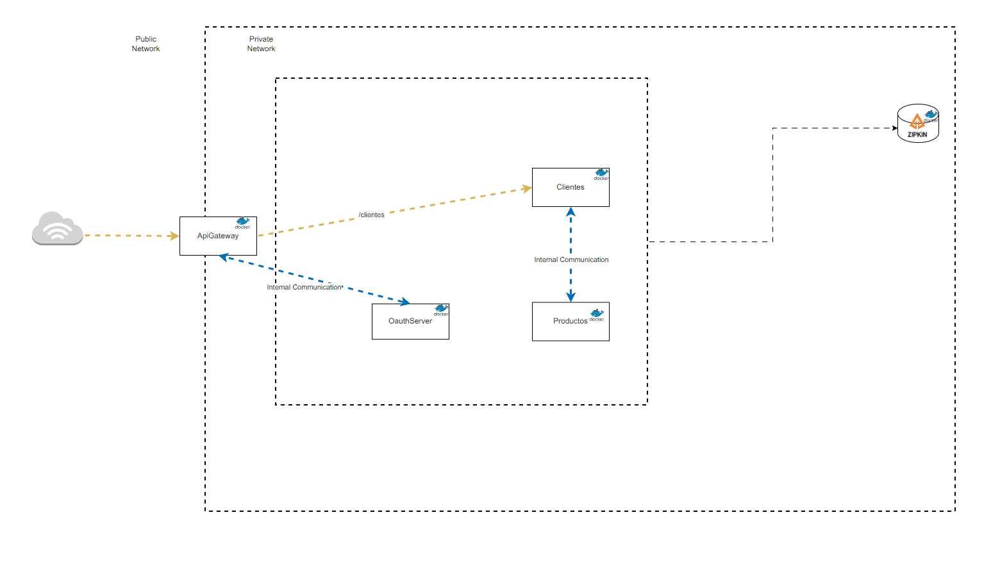

# Reto Backend API

Este proyecto es un sistema de microservicios basado en Spring Boot 3.2.7 con Java 17 y Spring WebFlux. El sistema incluye los siguientes microservicios:

- **ms-cliente**: Maneja la información de los clientes.
- **ms-producto**: Maneja la información de los productos financieros.
- **oauth-server**: Servidor de autenticación y autorización utilizando OAuth2.
- **spring-cloud-gateway**: Gateway que maneja el enrutamiento y autenticación centralizada.

## Requisitos

- Java 17
- Maven 3.8.1+
- Docker (opcional, para despliegue de contenedores)

## Arquitectura

La arquitectura del proyecto está basada en microservicios y utiliza Spring Cloud Gateway para enrutamiento y balanceo de carga, y OAuth2 para la autenticación y autorización.



## Servicios

### ms-cliente

Microservicio encargado de gestionar la información de los clientes.

#### Endpoints

- `GET /clientes/buscar/{id}`: Obtiene la información de un cliente por ID.

### ms-producto

Microservicio encargado de gestionar la información de los productos financieros.

#### Endpoints

- `GET /productos/{clienteId}`: Obtiene todos los productos de un cliente por su ID.

### oauth-server

Servidor de autenticación y autorización utilizando OAuth2.

#### Endpoints

- `POST /oauth/token`: Obtiene un token de acceso.
- `GET /oauth/authorize`: Autoriza una solicitud de acceso.

### spring-cloud-gateway

Gateway para manejar el enrutamiento y la autenticación centralizada.

#### Endpoints

- `GET /{service}/{endpoint}`: Enruta las solicitudes a los microservicios correspondientes.

## Configuración

### OpenAPI Swagger

Cada microservicio tiene documentación Swagger disponible en la siguiente URL:

- `http://{host}:{port}/swagger-ui.html`

### Ejecución

Para ejecutar cada microservicio, navega al directorio del microservicio y utiliza el siguiente comando de Maven:

```bash
mvn spring-boot:run
